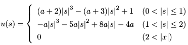

# Bicubic-interpolation
This repository is for simple implementation of 'Bicubic-interpolation for images' (Python3). 

## Table of contents
  * [Formulation](#Formulation)
  * [Example](#Example)
  * [Requirement](#Requirement)
  * [Installation](#Installation)
  * [Usage](#Usage)
  * [Reference](#Reference)
  * [Author](#Author)
  
## Formulation
  * Interpolation kernel  
  
  
## Example
  * Upscale input image 2 times (ratio = 2)  
  *Input image (216x216)*
  *Output image (512x512)*
  
## Requirement
  * Python 3.5.2 or more 

## Installation
  * `$ git clone https://github.com/rootpine/Bicubic-interpolation.git`

## Usage
   1. `$ python3 bicubic.py`

## Reference
  * R. Keys, "Cubic convolution interpolation for digital image processing," in IEEE Transactions on Acoustics, Speech, and Signal Processing, vol. 29, no. 6, pp. 1153-1160, December 1981. URL: <http://ieeexplore.ieee.org/stamp/stamp.jsp?tp=&arnumber=1163711&isnumber=26156>

## Author
  [@rootpine][https://github.com/rootpine/]
